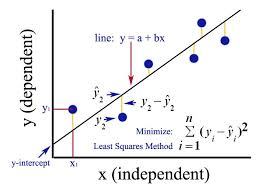

# Regression :
 * y=b0+b1*x
    * y= Dependent Varible (DV) it is variable we try to explain
    * b0= constant for example in this case base salary for employee with 0 year of experience 
    * x=Independent Varible (IV)
    * b1= coefficient 
# best fiting line :ordinary least square
 * 

